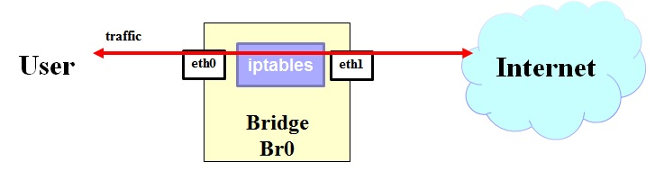

# 1. End-user 

## 1.1 Description / general readme

This PSA implements a classical firewall application. It makes possible to allow or deny specific traffic by specifying a category or a list (whitelist or blacklist). 
The available traffic category are:
* Internet traffic: i.e. the traffic of the public network
* Intranet traffic: i.e. the traffic of the internal network defined by a list of IP addresses
* DNS traffic: i.e. the traffic that uses port UDP/53
* VOIP traffic: i.e. the traffic that belongs to the following set of ports: 5060/UDP, 5060/TCP, 5061/UDP, 5061/TCP, 389/TCP, 4000/TCP-4005/TCP, 522/TCP, 1731/TCP, 1720/TCP, 16384/UDP-32767/UDP
* all traffic: i.e. every type of traffic

A list (whitelist or blacklist) contains a set of IP addresses that must be allowed or blocked. A list is defined as XML file packed into the SECURED GGUI.
Currently, the provided predefined lists are: 
* antiparental_control_proxies: that contains the list of IP addresses of proxies that could be used for bypassing parental control. This is typically used as a blacklist
* family_shield_dns: that contains the list of approved DNS servers. This is typically used as a whitelist.

## 1.2 Features / Capabilities

The list of capabilities are (extracted from manifest):

* L4 filtering

The L4 filtering capability is equivalent to classical firewall functionality. Therefore, this capability permits to allow and deny traffic identified by IP addresses.

## 1.3 Security policy examples

The following examples list *all possibly policies* that can be enabled from the SECURED GGUI. Note that the following policies are also available by considering *is authorized to access* and by omitting the name of the user.

``` Alice is not authorized to access Internet traffic (traffic_target, {antiparental_control_proxies}) ```
- This policy configures iptables PSA to block use of proxies for the IP address of Alice. The list of proxies are defined into a blacklist (XML) file, packed into the SECURED GGUI.

``` Alice is authorized to access Internet traffic (time period, {18:30-20:00 Europe/Rome}) ```
- This policy configures iptables PSA to allow Internet traffic for IP address of Alice only between 18:30 and 20:00 considering the timezone of Europe/Rome.

``` Alice is not authorized to access Internet traffic  ```
- This policy configures iptables PSA to block Internet traffic for the IP address of Alice. 

``` Alice is not authorized to access Intranet traffic  ```
- This policy configures iptables PSA to block Intranet traffic for the IP address of Alice. 

``` Alice is not authorized to access DNS traffic  ```
- This policy configures iptables PSA to block DNS traffic for the IP address of Alice. As described above, the blocked port is 53/UDP.

``` Alice is authorized to access DNS traffic (traffic_target, {family_shield_dns}) ```
- This policy configures iptables PSA to allow DNS traffic (only coming from/to the approved set of DNS servers) for the IP address of Alice. As described above, the family_shield_dns is a whitelist.

``` Alice is not authorized to access VOIP traffic  ```
- This policy configures iptables PSA to block VOIP traffic for the IP address of Alice. As described above, the blocked ports are: 5060/UDP, 5060/TCP, 5061/UDP, 5061/TCP, 389/TCP, 4000/TCP-4005/TCP, 522/TCP, 1731/TCP, 1720/TCP, 16384/UDP-32767/UDP.

``` Alice is not authorized to access all traffic  ```
- This policy configures iptables PSA to block all traffic for the IP address of Alice. 

Note: the set of policies defined for a user must have the same action (*is authorized to access* or *is not authorized to access*).
 
## 1.4 Support, troubleshooting / known issues

If there are any known issues, list them here.


# 2. Developer / admin

## Description / general readme

iptables PSA has born with the aim to permit and block communications up to layer 4 of the ISO/OSI stack.

Conceptually this PSA is transparent to user, once it is enabled from the NED client.

## Components and Requirements

VM technology allows creating a full system for the PSA. The components used in this PSA are:

* Operative System: Debian 7 "wheezy"
* iptables 
* brigde-utils
* xtables-addons-common
* python
* gunicorn
* pip
* falcon
* requests

The most important requirement is the need of an IP address in the PSA belonging to the same LAN than End user. 


## Detailed architecture

There is only a component in the internal architecture:

* **L4 Filtering**. iptables allows to implement a transparent filtering up to layer 4 traffic in the bridge from the user side interface (eth0) to the Internet side (eth1).




## Virtual machine image creation

The procedure to create a valid PSA image from scratch start with the prerequisite instructions defined in  [PSA Developer guide](https://github.com/SECURED-FP7/secured-psa-develop-test) to obtain a valid base image for PSA. 


Install the software netfilter/iptables. 

```
apt-get install iptables
```

Change passwords for user 'root' and user 'psa' for security reasons.

## Support, troubleshooting / known issues

Currently, no issues are reported.

## Files required

In order to make PSA running correctly no additional files are required.

### PSA application image

PSA is based on a Virtual machine image in KVM- kernel module format ".img". A [sample image has been included](https://vm-images.secured-fp7.eu/images/priv/iptables_time.img) in the project.

### Manifest

The PSA manifest is available at [Manifest](docs/iptables_Manifest.xml). And reflects the capabilities described below. 

This file must be stored in the PSAR.

### HSPL

The HSLP is define as follows:

* D4.1 Format:

``` Alice is not authorized to access Internet traffic (traffic_target, {antiparental_control_proxies}) ```
``` Alice is authorized to access Internet traffic (time period, {18:30-20:00 Europe/Rome}) ```


* More friendly expression

		Deny Internet access to proxies for Alice
		Authorize Internet access from 18:30 to 20:00 considering Europe/Rome timezone

### MSPL

An example of MSPL for this PSA are accesible at SPM project.

[MSPL.xml](docs/MSPL.xml) is a configuration that denies Internet access to Alice.
[MSPL_iptables.xml](docs/MSPL.xml) is a configuration that blocks some traffic during working hours.


### M2L Plug-in

The M2l plug-in is available at [M2LPlugin](https://github.com/SECURED-FP7/secured-spm/blob/master/M2LService/code/M2LPluginIptables/src/eu/securedfp7/m2lservice/plugin/M2LPlugin.java)

Current version of this plugin will generate different possible low level configurations. Some examples are available at [Config](https://github.com/SECURED-FP7/secured-spm/blob/master/M2LService/code/M2LPluginIptables) 

This plugin do not need additional external information in this version that must be store in the PSAR.


## Features/Capabilities

The list of capabilities are (extracted from manifest):

* L4 Filtering.

## Testing

Testing scripts are available at [test folder](tests)


# 3. License

Please refer to project LICENSE file.

# Additional Information 
## Partners involved

* Application: POLITO
* MSPL: POLITO
* M2L Plugin: POLITO

# Status (OK/No/Partial) 

* OK

# TODO:
Software improvements:
*       nothing

# Schedule

* 05/04/2016. Updates on HSPL, security policy examples and virtual machine image creation
* 16/03/2016. Basic documentation inserted
